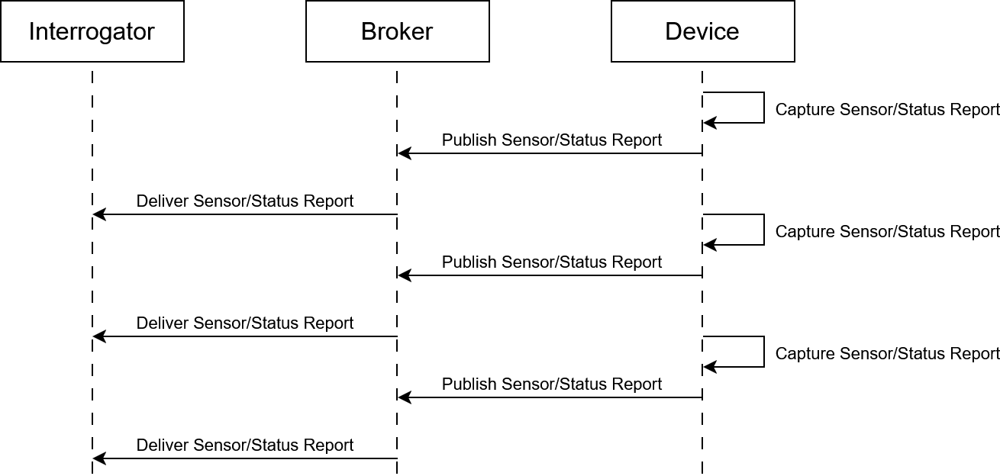
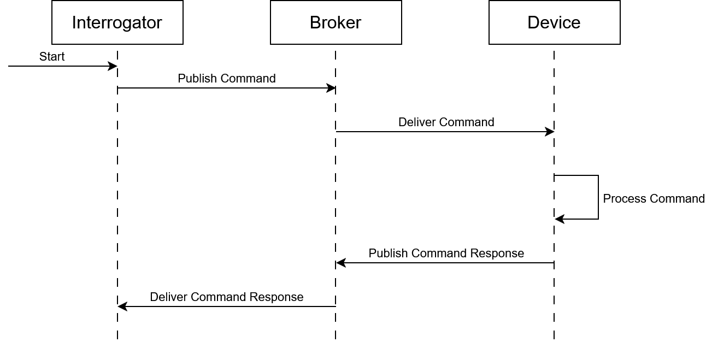
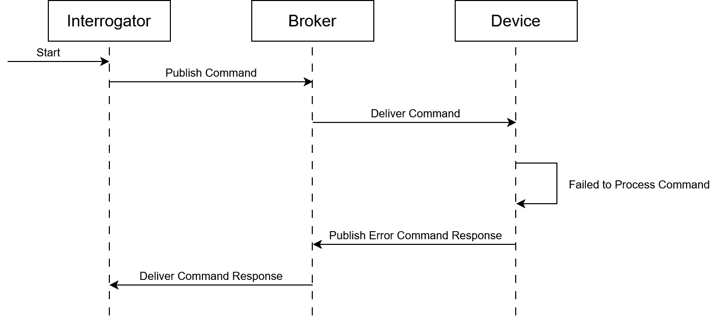

## Actors in the MQTT Communication

Before describing the communication flow, it's important to define the components involved:

- **Device**  
  The endpoint hardware (datalogger, sensor node, embedded reader) that publishes and/or subscribes to MQTT topics.

- **Broker**  
  The MQTT server responsible for routing messages between publishers and subscribers.  

- **Interrogator**  
  The controller or host system that issues commands, receives responses, and manages device interactions through MQTT topics.

## Communication Models

In this system, two different communication models can be used between the **Interrogator**, **Device**, and **Broker**. Each model has different timing behavior and reliability considerations.

### 1. Periodic Report Model

In this model, the Device sends the same report to the Interrogator at a fixed interval (every *X* seconds). This communication is used to sends sensor reports to the Interrogator.

**Characteristics:**
- Simple implementation.
- No strict dependency on responses.
- Useful for periodic status updates.
- Can generate unnecessary traffic if the command rate is high.

### 2. Request/Response Model

In this model, the Interrogator sends a command **only** when needed and waits for a response before sending the next one.  

**Characteristics:**
- More reliable and controlled.
- Ensures each command is acknowledged before continuing.
- Reduces unnecessary traffic.
- Timeout handling is required in case the Device does not respond.

#### 2.1 Error Message

If a command cannot be executed successfully, whether due to schema validation failures, invalid parameters, or any other processing issue—the system will return an error response.
This response clearly indicates that the command was not executed and provides details to help identify and resolve the underlying issue.

